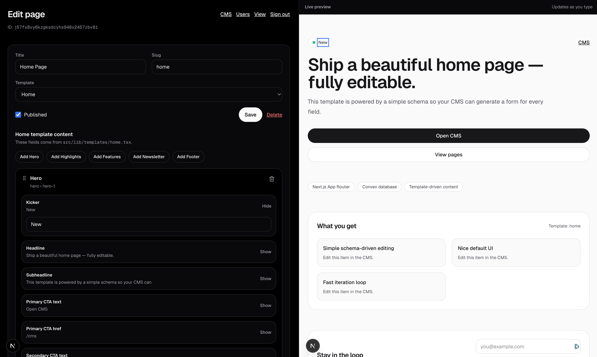

# YOLO CMS

Why pay for expensive+crappy CMS tools when you can just vibe-yeet stuff into production.

Introducing YOLO CMS, the CMS that just does shit you tell it to without guardrails.




## Installation

1. Setup your convex backend

```bash
npm i
npm run dev:convex
```

Then ctrl+c.

2. Run backend and frontend together

```bash
npm run dev
```

3. Go to `localhost:3000` and create an account.

4. Start vibe-coding your templates+navbar using prompts, then give the CMS to your team/client to edit the content.

5. Deploy to prod with vercel - `https://docs.convex.dev/production/hosting/vercel`

## See how it was built

Check out `./.specstory` for the prompts that were used to generate YOLO CMS.

## Contributions

Feel free to create issues and PRs, just note that I'll only be working on this when I'm at least 3 beers deep.
